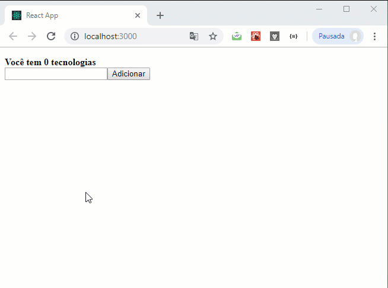

<h1 align="center">
    
</h1>

<p align="center">
  

  <a href="https://rocketseat.com.br">
    
  </a>

  
</p>

# Módulo 8: Utilizando React Hooks

Desenvolvimento de um componente utilizando Hooks para a inserção e armazenamento de tecnologias no LocalStorage do navegador.

## Passo a passo das instalações de todas as bibliotecas e plugins:

### 1º Passo: Criar projeto

```
npx create-react-app my-app ou yarn create-app my-app
```

### 2º Passo: Rodar yarn para atualizar e resolver pacotes

```
yarn
```

### 3º Passo: Configurar EditorConfig

Crie o arquivo **.editorconfig** pelo menu de contexto do vscode.

```js
root = true

[*]
end_of_line = lf
indent_style = space
indent_size = 2
charset = utf-8
trim_trailing_whitespace = true
insert_final_newline = true
```

### 4º Passo: Instalar e Configurar Eslint em ambiente de dev.

Usado para informar erros no código

```
yarn add eslint -D
```

#### Iniciar Configurações:

```
yarn add eslint –init
```

```
	To check syntax, find problems, and enforce code style
	JavaScript modules (import/export)
	React
	Does your project use TypeScript? (y/N) N
	(*) Browser
	Use a popular style guide
	Airbnb (https://github.com/airbnb/javascript)
	JavaScript
	Would you like to install them now with npm? (Y/n) Y
```

#### Configurações Finais:

Excluir arquivo **package-lock.json**.
Executar `yarn` na raiz do projeto para atualizar as dependências.

### 5º Passo: Instalar e Configurar Eslint/Prettier em Ambiente Dev.

Prettier é usado para formatar e deixar visualmente melhor o código. E todas as bibliotecas abaixo são para que todos se comuniquem e sejam relacionados, até mesmo o babel-eslint que integra a versão mais atualizada do JavaScript.

```
yarn add prettier eslint-config-prettier eslint-plugin-prettier babel-eslint -D
```

### 6º Passo: Instalar Plugin do Eslint para utilização do React Hooks.

Plugin para avisar se estamos utilizando a API do React da forma correta.

```
yarn add eslint-plugin-react-hooks -D
```

### Aplicação


